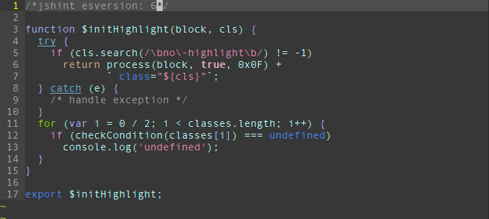
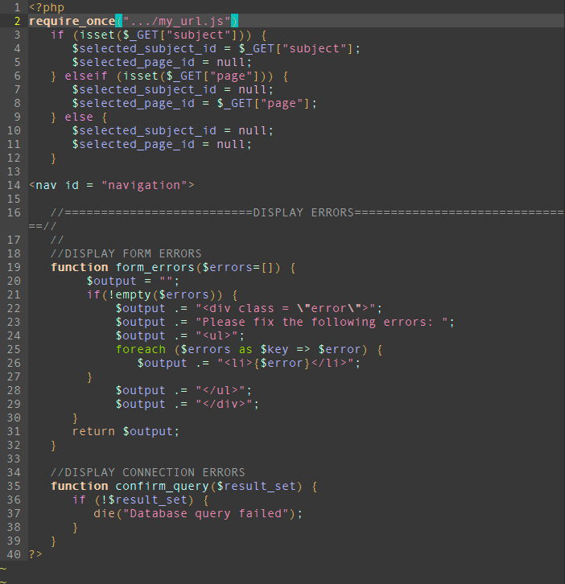
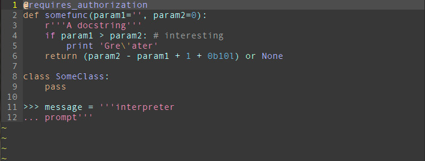
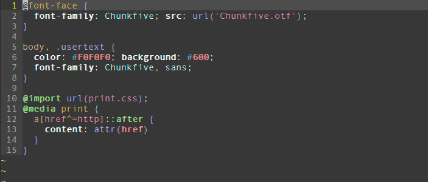
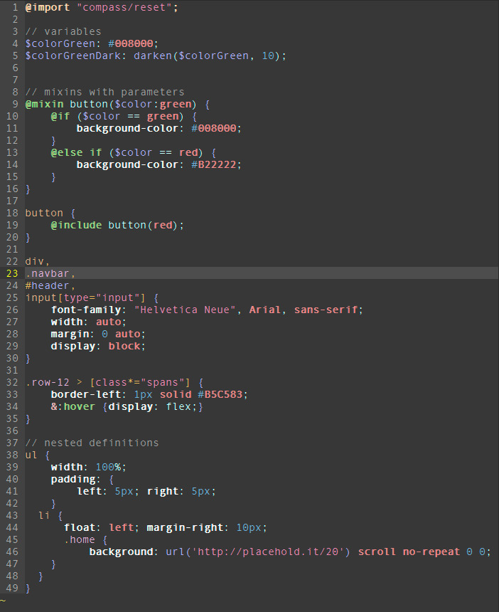

# MyDust
A vim color scheme inspired by the blackdust theme on [vivify](http://bytefluent.com/vivify/)

This color scheme works well in a 256 color enabled terminal version of vim, or gvim. 
It looks abhorent in windows command line. Be warned.

It is currently very much a work in progress. I'm fixing syntax highlighting as I go. Here are a few screen shots:

(These are all terminal vim, but gvim is extremely similar)

### Javascript

### HTML

### PHP

### Python

### CSS

### SCSS

